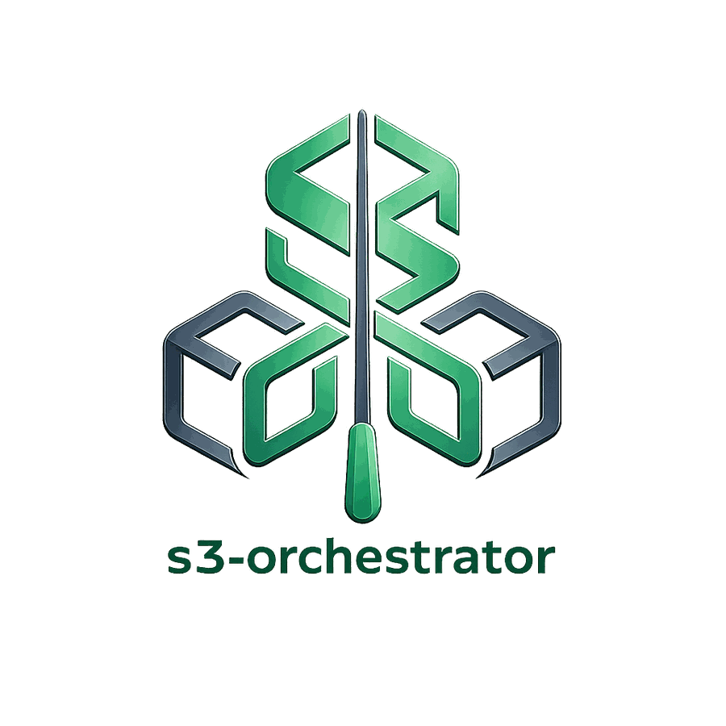

<p align="center">
  
</p>

# s3-orchestrator

[](https://github.com/afreidah/s3-orchestrator/actions/workflows/ci.yml)
[](https://sonarcloud.io/summary/new_code?id=afreidah_s3-orchestrator)
[](https://sonarcloud.io/summary/new_code?id=afreidah_s3-orchestrator)
[](https://opensource.org/licenses/MIT)

<p align="center">
  <strong><a href="https://s3-orchestrator.munchbox.cc">Project Website</a></strong> · <strong><a href="https://s3-orchestrator.munchbox.cc/docs/">Documentation</a></strong> · <strong><a href="https://s3-orchestrator.munchbox.cc/guides/maximizing-free-tiers/">Maximizing Free-Tier Storage</a></strong>
</p>

Put one S3-compatible endpoint in front of multiple S3 backends. The orchestrator tracks where every object lives in PostgreSQL (or embedded SQLite), enforces per-backend byte quotas, replicates objects across clouds on a configurable factor, and gives operators real primitives — drain, rebalance, integrity scrub, online failover — instead of pushing that work onto every client.

Add as many S3-compatible backends as you want — OCI Object Storage, Backblaze B2, AWS S3, MinIO, Wasabi, anything that speaks S3 — and the orchestrator presents them as one or more virtual buckets. Cap each backend at the byte limit you choose to stack free-tier allocations into one larger logical bucket without surprise bills. Set a replication factor and every object lands on N providers automatically.

## Who this is for

| Audience | Use case |
|---|---|
| **Homelabbers** | Stack free-tier allocations from multiple providers into usable storage without paying for a single plan. |
| **Self-hosters running MinIO** | Add automatic cloud backups to a local MinIO instance with one config change — no sync scripts or extra tooling. |
| **Small teams and startups** | Multi-cloud redundancy and encryption without the cost or complexity of enterprise storage platforms. |
| **Anyone wanting provider independence** | Applications talk S3 to one endpoint — swap, add, or remove backends without touching a line of code. |

## What's in the box

- **A metadata layer that knows.** Every object's backend placement, replica set, quota delta, and orphan bytes live in a real database. Failover reads, degraded-mode broadcast on DB outage, drain, rebalance, and integrity scrub all key off it — none require backend-side coordination.
- **Per-backend quotas + multi-cloud replication, configured side-by-side.** Stack a 10 GB OCI free tier, a 5 GB B2 free tier, and a 20 GB AWS cap into one 35 GB logical bucket. Replicate every object across two of them. Both are operator-configurable and hot-reloadable.
- **Operations-grade plumbing.** Circuit breakers (per-backend + per-DB), bounded degraded-read broadcast with parallelism caps, online drain with progress reporting, online rebalance, PUT-before-COMMIT pending intents, durable cleanup queue with DLQ, envelope encryption (AES-256-GCM, Vault Transit), integrity scrub + content-hash backfill, Prometheus + OpenTelemetry, admin API, web UI, read-only terminal object browser (`tui`).

## What else is out there

If you've gone looking for a tool that does something similar, there don't appear to be many options:

| Project | What it is | Why it's not the same |
|---|---|---|
| **rclone `union` remote** | Client-side multi-remote stacking | Per-client config, no server endpoint, no central drain/rebalance/quota enforcement |
| **MinIO Gateway** | Was a multi-backend S3 proxy | [Deprecated in 2022](https://blog.min.io/deprecation-of-the-minio-gateway/) |
| **[Flexify.IO](https://flexify.io/multi-cloud)** | Commercial multi-cloud S3 SaaS | Closed source; $0.03/GiB SaaS or $0.09/hr self-hosted |
| **[gaul/s3proxy](https://github.com/gaul/s3proxy)**, **[oxyno-zeta/s3-proxy](https://oxyno-zeta.github.io/s3-proxy/)** | S3 API translation / routing proxies | Single backend at a time, or multi-bucket routing without quotas, replication, or a metadata layer |

## Quickstart

**Prerequisites:** Go 1.27+, Docker, Make.

```bash
git clone https://github.com/afreidah/s3-orchestrator.git
cd s3-orchestrator
make run
```

Starts three MinIO backends via Docker Compose, embedded SQLite as the metadata store, and the orchestrator on `localhost:9000`.

```bash
aws --endpoint-url http://localhost:9000 s3 cp /etc/hostname s3://photos/test.txt
aws --endpoint-url http://localhost:9000 s3 ls s3://photos/
```

Default credentials: access key `photoskey`, secret `photossecret`. Web dashboard at [localhost:9000/ui/](http://localhost:9000/ui/) (login `admin` / `admin`).

Full credentials and troubleshooting: [docs/quickstart.md](docs/quickstart.md).

## Install

| Channel | Source |
|---|---|
| Container | `docker pull ghcr.io/afreidah/s3-orchestrator:<version>` |
| Debian / Ubuntu | `.deb` from [GitHub Releases](https://github.com/afreidah/s3-orchestrator/releases) |
| Static binary | Linux / macOS / Windows from [GitHub Releases](https://github.com/afreidah/s3-orchestrator/releases) |
| From source | `git clone && make build` |

**Database:** SQLite is embedded — no external dependencies for single-instance use. PostgreSQL 14+ is also an option and is required for multi-instance deployments (`database.driver: postgres`); the schema migrates on boot.

**Generate a config interactively:** `s3-orchestrator init`.

### Verify release artifacts

Container images and release checksums are signed with [cosign](https://github.com/sigstore/cosign) (keyless / Sigstore):

```bash
# Container image
cosign verify ghcr.io/afreidah/s3-orchestrator:<version> \
  --certificate-identity-regexp='github\.com/afreidah/s3-orchestrator' \
  --certificate-oidc-issuer='https://token.actions.githubusercontent.com'

# Release checksums
cosign verify-blob checksums.txt --bundle checksums.txt.bundle \
  --certificate-identity-regexp='github\.com/afreidah/s3-orchestrator' \
  --certificate-oidc-issuer='https://token.actions.githubusercontent.com'
```

## Architecture in 30 seconds

```
              S3 clients (aws cli, rclone, etc.)
                          |
                          v
                    +-----------+
                    | S3 Orch.  |  <-- SigV4 auth, rate limiting, quota routing
                    +-----------+
                     |         |
            +--------+         +------------------+------------------+
            v                  v                  v                  v
       PostgreSQL        OCI Object         Backblaze B2          AWS S3
       (metadata)       Storage (20 GB)       (10 GB)             (5 GB)
                              \                  |                  /
                               '------------ 35 GB total ---------'
```

Metadata (object locations, quota counters, multipart state, cleanup queue) lives in PostgreSQL or SQLite. Backends only ever see plain S3 calls — no orchestrator-specific protocol, no schema requirements. Any provider that speaks the AWS SDK works.

Deeper details: [docs/architecture.md](docs/architecture.md).

## Documentation

| Topic | Doc |
|---|---|
| First-run / demo | [Quickstart](docs/quickstart.md) |
| S3 client setup | [User Guide](docs/user-guide.md) |
| Architecture | [docs/architecture.md](docs/architecture.md) |
| Configuration walkthrough + hot-reload | [docs/configuration.md](docs/configuration.md) |
| Authentication (SigV4, tokens, multi-bucket) | [docs/authentication.md](docs/authentication.md) |
| Backends, quotas, routing strategies | [docs/backends.md](docs/backends.md) |
| Database engines, schema, migrations | [docs/database.md](docs/database.md) |
| Replication, over-replication, orphan reconciliation | [docs/replication.md](docs/replication.md) |
| Cleanup queue, lifecycle expiry, pending intents | [docs/cleanup-and-lifecycle.md](docs/cleanup-and-lifecycle.md) |
| Envelope encryption, Vault Transit | [docs/encryption.md](docs/encryption.md) |
| At-rest compression (chunked zstd) | [docs/compression.md](docs/compression.md) |
| Object tagging (key/value labels) | [docs/tagging.md](docs/tagging.md) |
| Operations (drain, rebalance, scrub, cache, trace) | [docs/operations.md](docs/operations.md) |
| Monitoring (Prometheus, OTel, audit log) | [docs/monitoring.md](docs/monitoring.md) |
| Background services reference | [docs/background-services.md](docs/background-services.md) |
| Webhook notifications | [docs/notifications.md](docs/notifications.md) |
| CLI subcommands | [docs/cli.md](docs/cli.md) |
| UI + Admin API JSON endpoints | [docs/api-reference.md](docs/api-reference.md) |
| Deployment (Nomad, Kubernetes, Docker) | [docs/deployment.md](docs/deployment.md) |
| Security hardening | [docs/security-hardening.md](docs/security-hardening.md) |
| Performance tuning | [docs/performance-tuning.md](docs/performance-tuning.md) |
| Disaster recovery | [docs/disaster-recovery.md](docs/disaster-recovery.md) |
| Version migration | [docs/version-migration.md](docs/version-migration.md) |
| Benchmark trends | [Live charts](https://afreidah.github.io/s3-orchestrator/dev/bench/) · [scheduled runs](https://github.com/afreidah/s3-orchestrator/actions/workflows/benchmarks.yml) |
| Coding conventions | [docs/style-guide.md](docs/style-guide.md) |
| Build / test / contribute | [CONTRIBUTING.md](CONTRIBUTING.md) |

## Contributing

Contributions welcome. Start with [CONTRIBUTING.md](CONTRIBUTING.md) for the build / test / submit workflow, and [docs/style-guide.md](docs/style-guide.md) for the codebase's conventions.

## License

[MIT](LICENSE)
